# MOOSE-FARMS: A MOOSE app for Fault and Rupture Mechanics Simulations

Chunhui Zhao<sup>1</sup>, Mohamed Abdelmeguid<sup>2</sup>, and Ahmed Elbanna<sup>1,3</sup>
Graduate Aerospace Laboratories, California Institute of Technology<sup>1</sup>
Department of Civil and Environmental Engineering, University of Illinois Urbana-Champaign<sup>2</sup>
Beckman Institute of Advanced Science and Technology, University of Illinois Urbana-Champaign<sup>3</sup>

## Part 1: Dynamic Rupture Simulation on a Frictional Planar Fault

This page serves as an introduction to simulating dynamic rupture with the planar fault in isotropic media using slip weakening friction law. The cohesive zone model (TensorMechanics/CohesiveZoneMaster) and central difference explicit time integration are used.

### Introduction

An overview of the methodology is given below, followed by a verification case of Southern California Earthquake Center (SCEC) benchmark problem TPV205.

#### The Mesh

The mesh generation is handled by MOOSE built-in mesh generator using functionalities from Cohesive Zone Model. Specifically, an initial mesh is generated using ```GeneratedMeshGenerator``` as a first step. Two subdomains, upper and lower blocks associated with planar fault are identified by calling ```ParsedSubdomainMeshGenerator```. Using the function ```BreakMeshByBlockGenerator```, an interface between the two blocks (fault surfaces) is created and the added nodes and boundaries between block pairs are taken care of.

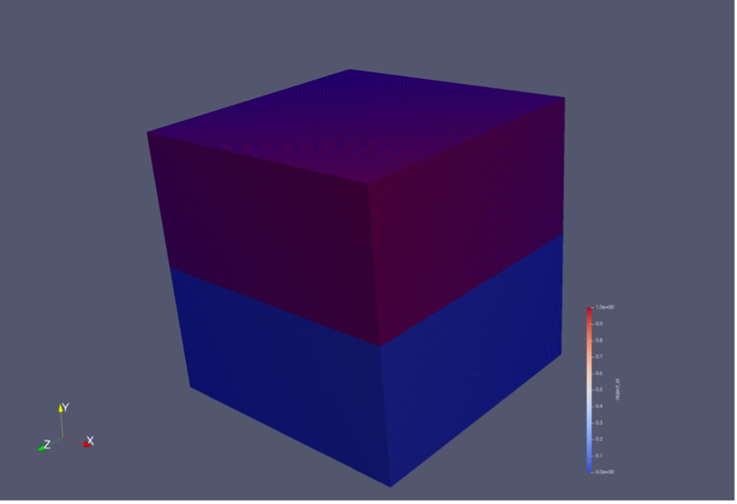

*Figure 1 Example 3D Mesh Configuration with QUAD4 Element (0 - upper block, 1 – lower block)*

Note the adopted coordinate convention defines the global fault surface as x-z plane. This convention is consistent with **Custom Material Kernel: SlipWeakeningFriction** section.

```SideSetsBetweenSubdomainsGenerator``` is used to mark primary and secondary interfaces and create sets.

The example input file for the ```Mesh``` section is given below:

```
[Mesh]
    [./msh]
      type = GeneratedMeshGenerator
      dim = 3
      nx = 150
      ny = 150
      nz = 150
      xmin = -15000
      xmax = 15000
      ymin = -15000
      ymax = 15000
      zmin = -15000
      zmax = 15000
    []
    [./new_block]
      type = ParsedSubdomainMeshGenerator
      input = msh
      combinatorial_geometry = 'y<0'
      block_id = 1
    []
    [./split]
      type = BreakMeshByBlockGenerator
      input = new_block
      split_interface = true
    []
    [interface]
        type = SideSetsBetweenSubdomainsGenerator
        input = split
        primary_block = 0
        paired_block = 1
        new_boundary = 'interface'
    []
    [secondary_interface]
        type = SideSetsBetweenSubdomainsGenerator
        input = interface
        primary_block = 1
        paired_block = 0
        new_boundary = 'secondary_interface'
    []
[]
```

*Figure 2 Mesh Generation: Input File*

Notice the inheritance relationship of block 0 and block 1. Initially all the mesh elements are marked as “0” (primary block), after the bottom block $(y < 0)$ is assigned marker “1” (secondary block), at the interface the upper edge (“0”) is defined as primary surface, where the lower edge (“1”) is defined as secondary surface. The rotation matrix, computed by MOOSE, is defined at its primary surface. The reverse of the primary/secondary surface definition will affect the rotation matrix. As explained in detail in **Materials** section, as global quantities are passed into the material kernel, the local-to-global mapping is essential to retrieve correct local quantities.

#### Weak Formulation

The dynamic rupture problem possesses the following weak form:

$$\begin{array}{r} - \int_{V}^{}{\sigma \cdot \nabla\psi}\ dV - q\int_{V}^{}{\overline{\sigma} \cdot \nabla\psi}dV + \int_{S_{T}}^{}{T\psi}\ dV + \int_{S_{f}^{+}}^{}{T^{f^{+}}\psi}\ dS + \int_{S_{f}^{-}}^{}{T^{f^{-}}\psi}\ dS - \int_{V}^{}{\rho\ddot{u}\ \psi}\ dV = 0\ \\ \end{array}\ \ (1)$$

Where $\sigma$ is the stress tensor, $\overline{\sigma}$ is the damping stress tensor, $T$ is the external traction forces, $\psi$ is the testing function, $\rho$ is the density, $\ddot{u}$ is the acceleration.

The stress divergence term after integration by part $\sigma \cdot \nabla\psi$ , the inertia term $\rho\ddot{u}$ and the stiffness proportional damping $q \overline{\sigma} \cdot \nabla \psi$ are integrated over the whole simulation domain $V$, while$\ T$ represents the surface tractions acting as external forces.

Importantly, traction $T^{f^{+}}$ on the upper fault surface $S_{f}^{+}$ and traction $T^{f^{-}}$ on the lower fault surface $S_{f}^{-}$ are handled through **custom material kernel inherited from Cohesive Zone Model**, which will be explained below in detail. We thus neglect these two on-fault surface traction terms when constructing the residuals.

#### Kernels

Three kernels, ```TensorMechanics/Master```, ```InertiaForce``` and ```StiffPropDamping``` are used to construct residual for this problem.

```TensorMechanics/Master``` automatically creates the ```StressDivergenceTensors``` kernel which provides the following term:

$$\begin{array}{r} \int_{V}^{}{\sigma \cdot \nabla\psi}\ dV(2) \end{array}$$

```InertiaForce``` gives the inertia term in the weak form:

$$\begin{array}{r} \int_{V}^{}{\rho\ddot{u}\ \psi}\ dV(3) \end{array}$$

Note that by using the default setting, ```InertiaForce``` kernel neglects the contribution of mass-dependent Rayleigh damping and HHT time integration scheme, which is not needed for explicit time integration scheme.

The input file defining both kernels are given below, note in 2D formulation, “plane strain” needs to be set:

```
[Modules]
[./TensorMechanics]
    [./Master]
    [./all]
        strain = SMALL
        add_variables = true
    [../]
    [../]
[../]
[]
``` 
```
[Modules]
[./TensorMechanics]
    [./Master]
    [./all]
        strain = SMALL
        add_variables = true
        planar_formulation = PLANE_STRAIN
        generate_output = 'stress_xx stress_yy stress_xy'
    [../]
    [../]
[../]
[]
```

*Figure 3-1 StressDivergenceTensors Kernels: Input File*

The inertia force kernel is given as follows:

```
[Kernels]
    [./inertia_x]
        type = InertialForce
        use_displaced_mesh = false
        variable = disp_x
    []
    [./inertia_y]
        type = InertialForce
        use_displaced_mesh = false
        variable = disp_y
    []
    [./inertia_z]
        type = InertialForce
        use_displaced_mesh = false
        variable = disp_z
    []
[]
```

*Figure 3-2 InertiaForce Kernels: Input File*

#### Custom Kernel: StiffPropDamping

```StiffPropDamping``` is a custom kernel for adding stiffness proportional damping into the system to reduce the high-frequency oscillations. The weak form is expressed as follows:

$$\begin{array}{r} q\int_{V}^{}{\overline{\sigma} \cdot \nabla\psi}dV (4) \end{array}$$

Where $\overline{\sigma}$ is the damping stress tensor, $q$ is damping constant. To see how the damping term is introduced, the .h and .cpp file is provided below:

The header file explains its inherence relation with its parent class ```StressDivergenceTensors```, which is introduced earlier.

```
#pragma once

#include "StressDivergenceTensors.h"

class StiffPropDamping : public StressDivergenceTensors
{
public:
  static InputParameters validParams();

  StiffPropDamping(const InputParameters & parameters);

protected:
  virtual Real computeQpResidual();

  const MaterialProperty<RankTwoTensor> & _stress_older;
  const MaterialProperty<RankTwoTensor> & _stress;
  Real _q;

};
```

*Figure 4 StiffPropDamping: Header File*

The source file implements the weak form evaluation at each quadrature point, here we follow similar definition of damping stress tensor given in (Day, 2005), Appendix A8:

$$\begin{array}{r} \overline{\sigma} = \Delta t\left\lbrack \frac{\sigma_{t} - \sigma{t - \Delta t}}{\Delta t} \right\rbrack = \left\lbrack \sigma_{t} - \sigma_{t - \Delta t} \right\rbrack (5)\end{array}$$

Where $\sigma_{t}$ and $\sigma_{t - \Delta t}$ are stress tensor from current/last time step. The code snippet is given below, notice that for each custom function, user needs to register the function to their own app using ```registerMooseObject```. (```farmsApp``` is a custom app name that can be replaced).

```
#include "StiffPropDamping.h"
#include "ElasticityTensorTools.h"

registerMooseObject("farmsApp", StiffPropDamping);

InputParameters
StiffPropDamping::validParams()
{
  InputParameters params = StressDivergenceTensors::validParams();
  params.addClassDescription(
      "Compute Stiffness Proportional Damping Residual");

  params.addParam<Real>("q", 0.1, "Ratio Factor to assign magnitude of stiffness proportional damping term");

  return params;
}

StiffPropDamping::StiffPropDamping(const InputParameters & parameters)
  : StressDivergenceTensors(parameters),
  
  //Get stress tensor from previous time step (older == previous time step in Explicit Time Integration Scheme)
  _stress_older(getMaterialPropertyOlderByName<RankTwoTensor>(_base_name + "stress")),
  
  //Get stress tensor from current time step
  _stress(getMaterialPropertyByName<RankTwoTensor>(_base_name + "stress")),
  
  //Ratio factor 
  _q(getParam<Real>("q"))

{
}

Real
StiffPropDamping::computeQpResidual()
{

  Real residual = 0.0;

  residual += _q*(_stress[_qp].row(_component)-_stress_older[_qp].row(_component)) * _grad_test[_i][_qp];

  return residual;
}
```

*Figure 5 StiffPropDamping: Source File*

To utilize the kernel, allocate it inside ```[Kernels]``` section of input file:

```
[./Reactionx]
    type = StiffPropDamping
    variable = 'disp_x'
    component = '0'
[]
[./Reactiony]
    type = StiffPropDamping
    variable = 'disp_y'
    component = '1'
[]
[./Reactionz]
    type = StiffPropDamping
    variable = 'disp_z'
    component = '2'
[]
```

*Figure 6 StiffPropDamping: Input File*

#### AuxKernels

All the quantities passed as variable input into the material kernel are defined as aux-variables. The code for defining aux variables residuals (```resid, resid_slipweakening```), nodal area (```nodal_area```), displacements (```disp_slipweakening```), velocity (```vel_slipweakening```) is given below:

```
[AuxVariables]
    [./resid_x]
        order = FIRST
        family = LAGRANGE
    [../]
    [./resid_y]
        order = FIRST
        family = LAGRANGE
    []
    [./resid_z]
        order = FIRST
        family = LAGRANGE
    []
    [./nodal_area]
        order = FIRST
        family = LAGRANGE
    [../]
    [./resid_slipweakening_x]
        order = FIRST
        family = LAGRANGE
    [../]
    [./resid_slipweakening_y]
        order = FIRST
        family = LAGRANGE
    [../]
    [./resid_slipweakening_z]
        order = FIRST
        family = LAGRANGE
    [../]
    [./disp_slipweakening_x]
        order = FIRST
        family = LAGRANGE
    []
    [./disp_slipweakening_y]
        order = FIRST
        family = LAGRANGE
    []
    [./disp_slipweakening_z]
        order = FIRST
        family = LAGRANGE
    []
    [./vel_slipweakening_x]
        order = FIRST
        family = LAGRANGE
    []
    [./vel_slipweakening_y]
        order = FIRST
        family = LAGRANGE
    []
    [./vel_slipweakening_z]
        order = FIRST
        family = LAGRANGE
    []
[]
```

*Figure 7 AuxVariables: Input File*

Two Aux Kernels ```CompVar``` ```CompVarRate``` are defined to pass/store data ```coupled```, data time change ```coupledDot``` to aux variables. Below provides the input file:

```
[AuxKernels]
    [Vel_x]
      type = CompVarRate
      variable = vel_slipweakening_x
      coupled = disp_x
      execute_on = 'TIMESTEP_BEGIN'
    []
    [Vel_y]
      type = CompVarRate
      variable = vel_slipweakening_y
      coupled = disp_y
      execute_on = 'TIMESTEP_BEGIN'
    []
    [Vel_z]
      type = CompVarRate
      variable = vel_slipweakening_z
      coupled = disp_z
      execute_on = 'TIMESTEP_BEGIN'
    []
    [Displacment_x]
      type = CompVar
      variable = disp_slipweakening_x
      coupled = disp_x
      execute_on = 'TIMESTEP_BEGIN'
    []
    [Displacement_y]
      type = CompVar
      variable = disp_slipweakening_y
      coupled = disp_y
      execute_on = 'TIMESTEP_BEGIN'
    []
    [Displacement_z]
      type = CompVar
      variable = disp_slipweakening_z
      coupled = disp_z
      execute_on = 'TIMESTEP_BEGIN'
    []
    [Residual_x]
      type = CompVar
      variable = resid_slipweakening_x
      coupled = resid_x
      execute_on = 'TIMESTEP_BEGIN'
    []
    [Residual_y]
      type = CompVar
      variable = resid_slipweakening_y
      coupled = resid_y
      execute_on = 'TIMESTEP_BEGIN'
    []
    [Residual_z]
      type = CompVar
      variable = resid_slipweakening_z
      coupled = resid_z
      execute_on = 'TIMESTEP_BEGIN'
    []
[]
```

*Figure 8 AuxKernels: Input File*

Notice ```TIMESTEP_BEGIN``` option makes all the aux kernel operations executed at the beginning of every time step before the system solve, this setting enforces the consistency of quantities being passed into the material kernel as will be explained in ```Solution Step``` section.

The time integration is handled using ```CentralDifference``` explicit time integrator with ```lumped``` mass solve type, the corresponding code is here:

```
[Executioner]
    type = Transient
    dt = 0.005
    end_time = 3.0
    [TimeIntegrator]
      type = CentralDifference
      solve_type = lumped
    []
[]
```

*Figure 9 CentralDifference: Input File*

#### UserObjects

To obtain the fault area at each quadrature point automatically, which is suitable for unstructed mesh, ```NodalArea```, an ```UserObject``` defined within ```Contact``` Module is called in the input file to compute tributary area of a point at the beginning of the simulation, the auxvariable is then passed into ```Material Kernel```. The code snippet is given below:

```
[UserObjects]
    [./nodal_area]
        type = NodalArea
        variable = nodal_area
        boundary = 'interface secondary_interface'
        execute_on = 'initial TIMESTEP_BEGIN'
    [../]
[]
```

*Figure 10 UserObjects: Input File*

#### MultiApps

To obtain the most up-to-date reactions from ```StressDivergenTensors```kernel, a multiapp is set up and the sub app is supplied only to evaluate reactions using the current displacements and pass the values back to the main app and proceeds with material kernel. The code to set up ```MultiApps``` is given as follows:

```
[MultiApps]
    [./sub_app]
      type = TransientMultiApp
      positions = '0 0 0'
      input_files = 'tpv2053D_v3_sub.i'
      execute_on = 'TIMESTEP_BEGIN'
    [../]
  []

  [Transfers]
    [pull_resid]
      type = MultiAppCopyTransfer
      from_multi_app = sub_app
      source_variable = 'resid_sub_x resid_sub_y resid_sub_z'
      variable = 'resid_x resid_y resid_z'
      execute_on = 'TIMESTEP_BEGIN'
    []
    [push_disp]
      type = MultiAppCopyTransfer
      to_multi_app = sub_app
      source_variable = 'disp_x disp_y disp_z'
      variable = 'disp_sub_x disp_sub_y disp_sub_z'
      execute_on = 'TIMESTEP_BEGIN'
    []
[]
```

*Figure 11 UserObjects: Input File*

The ```[MultiApps]``` allocates the relation with sub-app file and the specified time for it to be executed ```(‘TIMESTEP_BEGIN’)```. This is important for the quantities of same time step to be passed into the material kernel. Using ```MultiAppCopyTransfer```, ```[Transfers]``` “push” displacements from main-app to sub-app and “pull” reactions from sub-app to main-app.

Since all the setup of sub-app are covered at this stage, the code is neglected here for simplicity. Readers are encouraged to refer to the source code for detail implementation.

#### Materials

Isotropic, linear elastic material is used for simplicity, but users are free to adopt other material types. The input file for this part is given below as an example:

```
[Materials]
    [elasticity]
        type = ComputeIsotropicElasticityTensor
        lambda = 32.04e9
        shear_modulus = 32.04e9
        use_displaced_mesh = false
    []
    [stress]
        type = ComputeLinearElasticStress
    []
    [density]
        type = GenericConstantMaterial
        prop_names = density
        prop_values = 2670
    []
    [./czm_mat]
        type = SlipWeakeningFriction3dv3
        disp_slipweakening_x     = disp_slipweakening_x
        disp_slipweakening_y     = disp_slipweakening_y
        disp_slipweakening_z     = disp_slipweakening_z
        reaction_slipweakening_x = resid_slipweakening_x
        reaction_slipweakening_y = resid_slipweakening_y
        reaction_slipweakening_z = resid_slipweakening_z
        nodal_area = nodal_area
        boundary = 'Block0_Block1'
    [../]
[]
```

*Figure 12 Materials: Input File*

Note a custom material kernel ```SlipWeakeningFriction3dv3``` is added after the definition of ```density```, this part related to the Cohesive Zone Model, and it is explained next.

#### Custom Material Kernel: SlipWeakeningFriction

Inheriting from ```InterfaceKernel```, the update of interface traction is accomplished by defining a custom material kernel. Following (Day, 2005) approach combing finite difference and traction-at-split node (TSN), the traction at the fault surface is calculated using the following equations to enforce continuity, see also (Ma, 2019). Here, a step-by-step instruction along with detailed code explanation is given below.

The header file is a subclass of ```CZMComputeLocalTractionTotalBase```:

```
#pragma once

#include "CZMComputeLocalTractionTotalBase.h"

class SlipWeakeningFriction3dv3 : public CZMComputeLocalTractionTotalBase
{
public:
  static InputParameters validParams();
  SlipWeakeningFriction3dv3(const InputParameters & parameters);

protected:
  /// method computing the total traction and its derivatives
  void computeInterfaceTractionAndDerivatives() override;

  Real _T2_o;
  Real _T3_o;
  Real _mu_d;
  Real _Dc;

  const VariableValue & _nodal_area;
  const VariableValue & _nodal_area_neighbor;

  const MaterialProperty<Real> & _density;

  const MaterialProperty<RankTwoTensor> & _rot;

  const VariableValue & _disp_slipweakening_x;
  const VariableValue & _disp_slipweakening_neighbor_x;
  const VariableValue & _disp_slipweakening_y;
  const VariableValue & _disp_slipweakening_neighbor_y;
  const VariableValue & _disp_slipweakening_z;
  const VariableValue & _disp_slipweakening_neighbor_z;

  const VariableValue & _reaction_slipweakening_x;
  const VariableValue & _reaction_slipweakening_neighbor_x;
  const VariableValue & _reaction_slipweakening_y;
  const VariableValue & _reaction_slipweakening_neighbor_y;
  const VariableValue & _reaction_slipweakening_z;
  const VariableValue & _reaction_slipweakening_neighbor_z;

  const VariableValue & _disp_slipweakening_x_old;
  const VariableValue & _disp_slipweakening_neighbor_x_old;
  const VariableValue & _disp_slipweakening_y_old;
  const VariableValue & _disp_slipweakening_neighbor_y_old;
  const VariableValue & _disp_slipweakening_z_old;
  const VariableValue & _disp_slipweakening_neighbor_z_old;
 
};
```

*Figure 13 SlipWeakeningFriction: Header File*

We allocate ```Real```, ```VariableValue``` parameters to take on the values passing from the input file, and the parameters extracted from the ```MaterialProperty``` is available to be evaluated at each quadrature point.

The source file first includes the header file we just defined and ```InterfaceKernel.h```, followed by constructor declaration which takes input data:

```
#include "SlipWeakeningFriction3dv3.h"
#include "InterfaceKernel.h"

registerMooseObject("farmsApp", SlipWeakeningFriction3dv3);

InputParameters
SlipWeakeningFriction3dv3::validParams()
{
  InputParameters params = CZMComputeLocalTractionTotalBase::validParams();
  params.addClassDescription("Linear Slip Weakening Traction Separation Law.");
  params.addParam<Real>("T2_o", 1.0, "Background normal traction");
  params.addParam<Real>("T3_o", 1.0, "Background shear traction in z dir");
  params.addParam<Real>("mu_d", 1.0, "Value of dynamic friction parameter");
  params.addParam<Real>("Dc", 1.0, "Value of characteristic length");
  params.addRequiredCoupledVar("nodal_area","nodal area");
  params.addRequiredCoupledVar("disp_slipweakening_x","displacement in x dir");
  params.addRequiredCoupledVar("disp_slipweakening_y","displacement in y dir");
  params.addRequiredCoupledVar("disp_slipweakening_z","displacement in z dir");
  params.addRequiredCoupledVar("reaction_slipweakening_x","reaction in x dir");
  params.addRequiredCoupledVar("reaction_slipweakening_y","reaction in y dir");
  params.addRequiredCoupledVar("reaction_slipweakening_z","reaction in z dir");
  return params;
}

SlipWeakeningFriction3dv3::SlipWeakeningFriction3dv3(const InputParameters & parameters)
  : CZMComputeLocalTractionTotalBase(parameters),
    _T2_o(getParam<Real>("T2_o")), 
    _T3_o(getParam<Real>("T3_o")),
    _mu_d(getParam<Real>("mu_d")),
    _Dc(getParam<Real>("Dc")),
    _nodal_area(coupledValue("nodal_area")),
    _nodal_area_neighbor(coupledValue("nodal_area")),
    _density(getMaterialPropertyByName<Real>(_base_name + "density")),
    _rot(getMaterialPropertyByName<RankTwoTensor>(_base_name + "czm_total_rotation")),
    _disp_slipweakening_x(coupledValue("disp_slipweakening_x")),
    _disp_slipweakening_neighbor_x(coupledNeighborValue("disp_slipweakening_x")),
    _disp_slipweakening_y(coupledValue("disp_slipweakening_y")),
    _disp_slipweakening_neighbor_y(coupledNeighborValue("disp_slipweakening_y")),
    _disp_slipweakening_z(coupledValue("disp_slipweakening_z")),
    _disp_slipweakening_neighbor_z(coupledNeighborValue("disp_slipweakening_z")),
    _reaction_slipweakening_x(coupledValue("reaction_slipweakening_x")),
    _reaction_slipweakening_neighbor_x(coupledNeighborValue("reaction_slipweakening_x")),
    _reaction_slipweakening_y(coupledValue("reaction_slipweakening_y")),
    _reaction_slipweakening_neighbor_y(coupledNeighborValue("reaction_slipweakening_y")),
    _reaction_slipweakening_z(coupledValue("reaction_slipweakening_z")),
    _reaction_slipweakening_neighbor_z(coupledNeighborValue("reaction_slipweakening_z")),
    _disp_slipweakening_x_old(coupledValueOld("disp_slipweakening_x")),
    _disp_slipweakening_neighbor_x_old(coupledNeighborValueOld("disp_slipweakening_x")),
    _disp_slipweakening_y_old(coupledValueOld("disp_slipweakening_y")),
    _disp_slipweakening_neighbor_y_old(coupledNeighborValueOld("disp_slipweakening_y")),
    _disp_slipweakening_z_old(coupledValueOld("disp_slipweakening_z")),
    _disp_slipweakening_neighbor_z_old(coupledNeighborValueOld("disp_slipweakening_z"))
{
}
```

*Figure 14 SlipWeakeningFriction: Source File (part 1)*

Moose provides easy access to ```neighbor``` quadrature point data across the interface by declaring ```coupledNeighborValue```, and ```old``` data from last time step evaluated at each quadrature point can be retrieved by declaring ```coupledValueOld``` or ```coupledNeighborValueOld```.

All the algorithms are implemented by overriding the function of ```InterfaceKernel```: ```computeInterfaceTractionAndDerivatives```, which takes displacement jump, reaction forces across the interface as input, compute and enforce traction boundary condition along the interface.

Before we proceed to the algorithm, coordinate transformation needs to be highlighted here: as previously mentioned, the global coordinate of traction direction ($n_{X}$, $n_{Y}$, $n_{Z}$) and local coordinate of traction direction ($n_{x}$, $n_{y}$, $n_{z}$) along the interface is defined along “primary surface”, in the current case, belongs to the block “0”, see the coordinate transformation sketch given below. Both local coordinate $(x, y, z)$ and global coordinate $(X, Y, Z)$ are defined using right-hand rule, but in local coordinate, the normal traction is in the first entry, followed by traction along x and z direction:

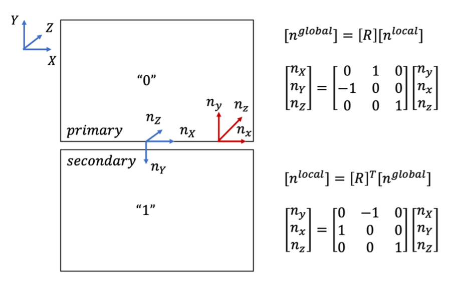

*Figure 15 Coordinate Transformation*

We now start by retrieving\computing all the necessary quantities:

The equation for rate of displacement jump $\dot{D}$ given displacement jump $D$ in global coordinate$ is as follows:

$$\begin{array}{r} D_{i}^{global} = u_{i}^{+} - u_{i}^{-} {\dot{D}}_{i}^{global} = {\dot{u}}_{i}^{+} - {\dot{u}}_{i}^{-} (6) \end{array}$$

The coordinate transformation is performed using rotation matrix $\mathbf{R}$ to obtain local displacement jump $D_{i}$ and local displacement jump rate $\dot{D}:$

$$D_{i} = \mathbf{R}^{\mathbf{T}}D_{i}^{global}\ {\dot{D}}_{i} = \mathbf{R}^{\mathbf{T}}{\dot{D}}_{i}^{global}(7)$$

The code snippet is given below:

```
Real T1_o = 0;
Real T2_o = _T2_o;
Real T3_o = _T3_o;

Real area = _nodal_area[_qp];
Real len  = std::sqrt(area);

Real x_coord =_q_point[_qp](0);
Real z_coord =_q_point[_qp](2);

//Reaction force in local coordinate
RealVectorValue R_plus_global(-_reaction_slipweakening_x[_qp],-_reaction_slipweakening_y[_qp], -_reaction_slipweakening_z[_qp]);
RealVectorValue R_minus_global(-_reaction_slipweakening_neighbor_x[_qp],-_reaction_slipweakening_neighbor_y[_qp], -_reaction_slipweakening_neighbor_z[_qp]);

RealVectorValue R_plus_local = _rot[_qp].transpose() * R_plus_global;
RealVectorValue R_minus_local = _rot[_qp].transpose() * R_minus_global;

Real R_plus_local_x  = R_plus_local(1);
Real R_plus_local_y  = R_plus_local(0);
Real R_plus_local_z  = R_plus_local(2);
Real R_minus_local_x = R_minus_local(1);
Real R_minus_local_y = R_minus_local(0);
Real R_minus_local_z = R_minus_local(2);

//Compute node mass
Real M = _density[_qp] * len * len * len / 2; 

//Compute mu_s for current qp
mu_s = computeMusDistribution3Dv3(x_coord, z_coord);

//Compute T1_o for current qp
T1_o = computeT1oDistribution3Dv3(x_coord, z_coord);
```

*Figure 16 SlipWeakeningFriction: Source File (part 2)*

Similarly, reactions at primary (plus) or secondary (minus) side
$R_{+ / -}$ are first defined in global coordinate and then transform
to local coordinate:

$$R_{+ / -}^{global} = ( - R_{x,\  + / -}, - R_{y,\  + / -}, - R_{z,\  + / -})$$

$$R_{+ / -} = \mathbf{R}^{\mathbf{T}}R_{+ / -}^{global}\ \ \ (8)$$

Notice the minus sign is added to obtain bulk to fault node traction.

The nodal mass $M^{\pm}$ for plus/minus side of fault surface is computed in an explicit form:

$$\begin{array}{r} M^{\pm} = \rho\frac{a^{3}}{2} (9) \end{array}$$

Where $\rho$ is the density, $a$ is the edge element size of the fault surface. Along with parameter initialization, the code is outlined below:

```
void
SlipWeakeningFriction3dv3::computeInterfaceTractionAndDerivatives()
{   
   //Global Displacement Jump
   RealVectorValue displacement_jump_global(_disp_slipweakening_x[_qp]-_disp_slipweakening_neighbor_x[_qp],_disp_slipweakening_y[_qp]-_disp_slipweakening_neighbor_y[_qp],_disp_slipweakening_z[_qp]-_disp_slipweakening_neighbor_z[_qp]);
   
   //Global Displacement Jump Old
   RealVectorValue displacement_jump_old_global(_disp_slipweakening_x_old[_qp]-_disp_slipweakening_neighbor_x_old[_qp],_disp_slipweakening_y_old[_qp]-_disp_slipweakening_neighbor_y_old[_qp],_disp_slipweakening_z_old[_qp]-_disp_slipweakening_neighbor_z_old[_qp]);

   //Global Displacement Jump Rate
   RealVectorValue displacement_jump_rate_global = (displacement_jump_global - displacement_jump_old_global)*(1/_dt);

   //Local Displacement Jump / Displacement Jump Rate
   RealVectorValue displacement_jump      = _rot[_qp].transpose() * displacement_jump_global;
   RealVectorValue displacement_jump_rate = _rot[_qp].transpose() * displacement_jump_rate_global;

   //Parameter initialization
   Real mu_s = 0; 
   Real mu_d = _mu_d; 
   Real Dc = _Dc; 
   Real tau_f = 0;
   
   Real T1_o = 0;
   Real T2_o = _T2_o;
   Real T3_o = _T3_o;

   Real area = _nodal_area[_qp];
   Real len  = std::sqrt(area);

   Real x_coord =_q_point[_qp](0);
   Real z_coord =_q_point[_qp](2);

   //Reaction force in local coordinate
   RealVectorValue R_plus_global(-_reaction_slipweakening_x[_qp],-_reaction_slipweakening_y[_qp], -_reaction_slipweakening_z[_qp]);
   RealVectorValue R_minus_global(-_reaction_slipweakening_neighbor_x[_qp],-_reaction_slipweakening_neighbor_y[_qp], -_reaction_slipweakening_neighbor_z[_qp]);

   RealVectorValue R_plus_local = _rot[_qp].transpose() * R_plus_global;
   RealVectorValue R_minus_local = _rot[_qp].transpose() * R_minus_global;

   Real R_plus_local_x  = R_plus_local(1);
   Real R_plus_local_y  = R_plus_local(0);
   Real R_plus_local_z  = R_plus_local(2);
   Real R_minus_local_x = R_minus_local(1);
   Real R_minus_local_y = R_minus_local(0);
   Real R_minus_local_z = R_minus_local(2);

   //Compute node mass
   Real M = _density[_qp] * len * len * len / 2; 

   //Compute mu_s for current qp
   mu_s = computeMusDistribution3Dv3(x_coord, z_coord);

   //Compute T1_o for current qp
   T1_o = computeT1oDistribution3Dv3(x_coord, z_coord);
```

*Figure 17 SlipWeakeningFriction: Source File (part 3)*

Notice that there are two functions, ```computeMusDistribution3Dv3``` and ```computeT1oDistribution3Dv3``` give the spatial distribution of static friction coefficient $\mu_{s}$ and background shear stress $\tau_{xy}$, respectively. Users are encouraged to modify the functions to accommodate different problem setup, here is an example for TPV205-3D as reference:

```
//Compute Spatial Distribution of Static Friction Parameter (mu_s)
//Problem-Specific: TPV205-3D
double computeMusDistribution3Dv3(Real x_coord, Real z_coord)
{
  double mu_s = 0.0;
  if ((x_coord<=(0.0+15e3))&&(x_coord>=(0.0-15e3)) && (z_coord<=(0.0+15e3))&&(z_coord>=(0.0-0.0)))
  {
	  mu_s = 0.677;
  }  
  else
  {
    mu_s = 10000.0;
  }
  return mu_s;
} 

//Compute Spatial Distribution of Background Shear Stress (T1_o)
//Problem-Specific: TPV205-3D
double computeT1oDistribution3Dv3(Real x_coord, Real z_coord)
{
  double T1_o = 0.0;
  if ((x_coord<=(0.0+1.5e3))&&(x_coord>=(0.0-1.5e3))&& (z_coord<=(7.5e3+1.5e3))&&(z_coord>=(7.5e3-1.5e3)))
  {
      T1_o = 81.6e6;
  }
  else if ((x_coord<=(-7.5e3+1.5e3))&&(x_coord>=(-7.5e3-1.5e3)) && (z_coord<=(7.5e3+1.5e3))&&(z_coord>=(7.5e3-1.5e3)))
  {
      T1_o = 78.0e6;
  }
  else if ((x_coord<=(7.5e3+1.5e3))&&(x_coord>=(7.5e3-1.5e3)) && (z_coord<=(7.5e3+1.5e3))&&(z_coord>=(7.5e3-1.5e3)))
  {
      T1_o = 62.0e6;
  }
  else
  {
      T1_o = 70.0e6;
  }
  return T1_o;
}
```

*Figure 18 computeMusDistribution” and “computeT1oDistribution" Example
Function*

With all the parameters at hand, the construction of ```SlipWeakeningFriction``` kernel proceeds by computing sticking traction ${\widetilde{T}}_{v}$, which enforces continuity of tangential velocity and normal displacement, refer to (Day, 2005) for detailed derivation:

$$\begin{array}{r}
{\widetilde{T}}_{v} = \ \frac{\Delta t^{- 1}M^{+}M^{-}\left( {\dot{u}}_{v}^{+} - {\dot{u}}_{v}^{-} \right) + M^{-}f_{v}^{+} - M^{+}f_{v}^{-}}{a^{2}\left( M^{+} + M^{-} \right)} + T_{v}^{0},\ \ v = x,z\ (10) \\
\end{array}$$

$$\begin{array}{r}
{\widetilde{T}}_{v} = \frac{- \Delta t^{- 1}M^{+}M^{-}\left\lbrack \left( {\dot{u}}_{v}^{+} - {\dot{u}}_{v}^{-} \right) + \Delta t^{- 1}\left( u_{v}^{+} - u_{v}^{-} \right) \right\rbrack - M^{-}f_{v}^{+} + M^{+}f_{v}^{-}}{a^{2}\left( M^{+} + M^{-} \right)} + T_{v}^{0},\ \ v = y\ \ \ (11) \\
\end{array}$$

Where
$M^{\pm},\ \ u_{i}^{\pm},\ \ {{\dot{u}}_{i}}^{\pm},\ f_{i}^{\pm},\ a$ are node mass, displacement, velocity, elastic forces for plus/minus side, the edge element size of the fault surface. The code is provided below:

```
//Compute sticking stress
   Real T1 =  (1/_dt)*M*displacement_jump_rate(1)/(2*len*len) + (R_plus_local_x - R_minus_local_x)/(2*len*len) + T1_o;
   Real T3 =  (1/_dt)*M*displacement_jump_rate(2)/(2*len*len) + (R_plus_local_z - R_minus_local_z)/(2*len*len) + T3_o;
   Real T2 =  -(1/_dt)*M*(displacement_jump_rate(0)+(1/_dt)*displacement_jump(0))/(2*len*len) + ( (R_minus_local_y - R_plus_local_y) / ( 2*len*len ) ) - T2_o ;
```

*Figure 19 SlipWeakeningFriction: Source File (part 4)*

The friction strength $\tau_{f}$, which is a function of slip magnitude,is computed below:

$$\begin{array}{r}
\tau_{f}(D) = \left\{ \begin{array}{r}
\tau_{s} - \frac{\left( \tau_{s} - \tau_{r} \right)\left| |D| \right|_{2}}{D_{c}} \\
\tau_{r},\ \ \left| |D| \right|_{2} \geq D_{c} \\
\end{array},\ \left| |D| \right|_{2} < D_{c} \right.\ \ \ (11) \\
\end{array}$$

$$\begin{array}{r}
\tau_{s} = \mu_{s}T_{2},\ \ \tau_{r} = \mu_{d}T_{2}\ \ \ (12) \\
\end{array}$$

$\tau_{s}$ and $\tau_{r}$ are the peak and residual frictional strength, $D_{c}$ is the critical slip required for stress to reach the residual value, $\mu_{s}$ and $\mu_{d}$ are static and dynamic friction parameters, respectively.

```
/Compute friction strength
   if (std::norm(displacement_jump) < Dc)
   {
     tau_f = (mu_s - (mu_s - mu_d)*std::norm(displacement_jump)/Dc)*(-T2); // square for shear component
   } 
   else
   {
     tau_f = mu_d * (-T2);
   }
```

*Figure 20 SlipWeakeningFriction: Source File (part 5)*

Note the negative sign with $T_{2}$ to ensure positiveness of $\tau_{s}$. The fault traction $T_{v}$ is then calculated to satisfy jump conditions:

$$\begin{array}{r}
T_{v} = \left\{ \begin{array}{r}
{\widetilde{T}}_{v},\ \ v = x,z,\ \ \left\lbrack \left( {\widetilde{T}}_{x} \right)^{2} + \left( {\widetilde{T}}_{z} \right)^{2} \right\rbrack \leq \tau_{f}\ \  \\
\tau_{f}\frac{{\widetilde{T}}_{v}}{\left\lbrack \left( {\widetilde{T}}_{x} \right)^{2} + \left( {\widetilde{T}}_{z} \right)^{2} \right\rbrack},\ \ v = x,z,\ \ \left\lbrack \left( {\widetilde{T}}_{x} \right)^{2} + \left( {\widetilde{T}}_{z} \right)^{2} \right\rbrack > \tau_{f}\ \ \  \\
\begin{matrix}
{\widetilde{T}}_{v},\ \ v = y,\ \ {\widetilde{T}}_{2} \leq 0 \\
0,\ \ v = y,\ \ {\widetilde{T}}_{2} > 0 \\
\end{matrix} \\
\end{array} \right.\ \#(13) \\
\end{array}$$

```
//Compute fault traction
   if (T2<0)
   {
   }else{
     T2 = 0;
   }

//Compute fault traction
   if (std::sqrt(T1*T1 + T3*T3)<tau_f)
   {
   
   }else{
     T1 = tau_f*T1/std::sqrt(T1*T1 + T3*T3);
     T3 = tau_f*T3/std::sqrt(T1*T1 + T3*T3);
   }
```

*Figure 21 SlipWeakeningFriction: Source File (part 6)*

Note that the first two conditions for $v = x,z$ in equation (12) are utilized for shear jump condition, which is implemented in the code, the last two conditions $v = y$ are used to enforce normal components jump conditions.

Finally, the new computed local tractions increments (measured from the initial stage) are plugged into the ```interface_traction``` to enforce traction boundary condition along the interface:

```
//Assign back traction in CZM
RealVectorValue traction;

traction(0) = T2+T2_o; 
traction(1) = -T1+T1_o; 
traction(2) = -T3+T3_o;

_interface_traction[_qp] = traction;
_dinterface_traction_djump[_qp] = 0;
```

*Figure 22 SlipWeakeningFriction: Source File (part 7)*

#### Solution steps:

All the previous steps are gathered and summarized below:

1.  ```[Mesh Generation]``` Generate mesh and interface using built-in mesh
    generator.

2.  ```[Sub-App Residual Calculation]``` Obtain up-to-date stress divergence
    term nodal reaction

3.  ```[Aux Variable Calculation]``` Update/store the displacement,
    reaction, velocity at current time step

4.  ```[Material Kernel Calculation 1]``` Using current quantities to
    enforce fault tractions

5.  ```[Residual Computation]``` Use Central difference computing residual
    using equation (2) (3) (4).

6.  ```[Material Kernel Calculation 2]``` Using current quantities to
    enforce fault tractions

7.  ```[Result Output]``` Output results

8.  Go back and repeat 1 with time marching.

Inside Material Kernel, do the following:

1.  Retrieve relevant aux variables (displacements, reactions at two
    sides of interface)

2.  Compute interface displacement jump $D$, calculate displacement jump
    rate $\dot{D}$ in the local coordinate using equation (6) (7), nodal
    mass $M^{\pm}$ using equation (8) (9).

3.  Compute sticking traction using equation (10), (11).

4.  Compute $\tau_{f}(D)$ using equation (11), (12)

5.  Compute $T_{v}$ using equation (13) and enforce as interface
    traction boundary condition

A flow chart is also provided below:

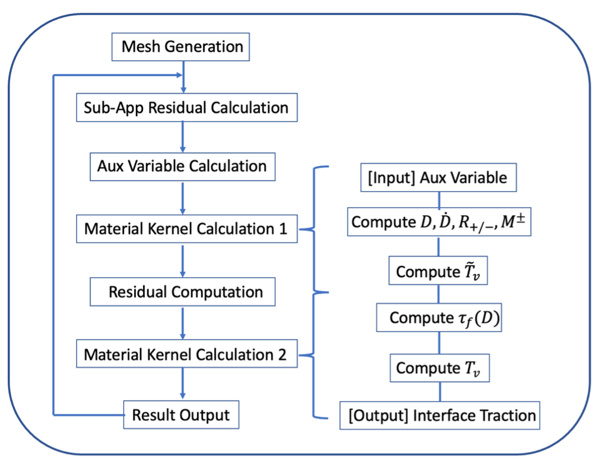

Figure 23 Flow chart

As an important note, it can be seen from the flow chart that material kernel is evaluated two times (before/after system solve) within each time step. This is due to the default feature of material kernel which all material properties which is function of solution variables are always up to date. This poses difficulties for reaction calculations to be consistent with material property update since there is no readily obtained approach to define reactions as a material property. Instead, we avoid defining all solution-dependent variables to be material properties and pass the time-step consistent aux variables into the material kernel to enforce continuity, in other words, there is no change between two material kernel calculations since all properties are updated only at the beginning of each time step rather than right after the system solve.

### Verification Case: TPV205-2D

#### Mesh:

A square mesh with uniform **QUAD4** element and mesh size 100m is created using MOOSE built-in mesh generator, following the descriptions in the previous section, the fault is represented as an interface using
**Cohesive Zone Model**.

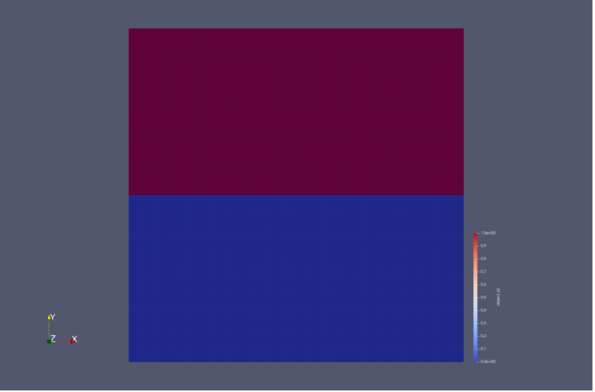

*Figure 24 Example 2D Mesh Configuration with QUAD4 Element (0 - lower block, 1 - upper block)*

#### Problem Description

We use the benchmark problem TPV205-2D from the SCEC Dynamic Rupture Validation exercises (Harris, 2009). Figure 3 shows the setup of the problem. The following assumptions are made:

1.  2D-in plane under plane strain condition,

2.  Fault is governed by linear slip-weakening friction law,

3.  Linear elastic homogeneous bulk material.

The rupture is nucleated using a 3-km wide overstressed region located at the center of the fault. The normal stress is uniform along the entire fault length while initial shear stress is nonuniform. Two strength barriers with length $L_{s}$, are located at the left and right edges of the fault. The barriers provide enough static frictional strength to stop the rupture propagation.

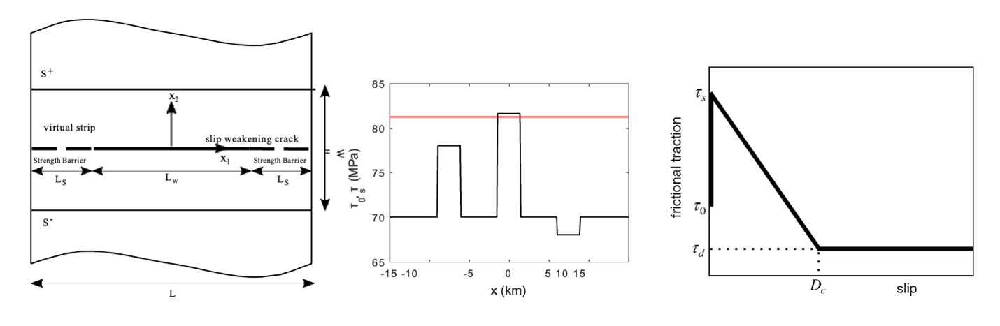

*Figure 25 TPV205 Problem Description (Problem Setup, Initial Shear Stress Distribution, Linear Slip Weakening Friction Law)*

The parameter table used for this validation is summarized in Table 1.

| Variable                                 | Value                                   | Description                |
|------------------------------------------|-----------------------------------------|----------------------------|
| $$\mathbf{\rho}$$                        | 2670 $kg/m^{3}$                         | Density                    |
| $$\mathbf{\lambda = \mu}$$               | 32.04 $GPa$                             | Lame Parameters            |
| $$\mathbf{T}_{\mathbf{2}}^{\mathbf{o}}$$ | 120 $MPa$                               | Background Normal Stress   |
| $$\mathbf{T}_{\mathbf{1}}^{\mathbf{o}}$$ | 81.6 $MPa$ where $abs(x)$ < 1.5 $km$;  78.0 $MPa$ where - 9$km$ < $x$ < - 6$km$;                62.0 $MPa$ where 6$km$ < $x$ < 9$km$; 70 $MPa$ elsewise                              | Background Shear Stress    |
| $$\mathbf{D}_{\mathbf{c}}$$              | 0.4 $m$                                 | Characteristic Length      |
| $$\mathbf{\mu}_{\mathbf{s}}$$            | 0.677,$abs(x)$ < 15 $km$; 10000, $abs(x)$ > 15$km$   | Static Friction Parameter  |
| $$\mathbf{\mu}_{\mathbf{d}}$$            | 0.525                                   | Dynamic Friction Parameter |
| $$\mathbf{\Delta}\mathbf{x}$$            | 100 m                                   | Mesh Size                  |

*Table 1 Simulation Parameter Table*

#### Results

The simulation runs up to *12s*. The results here compare the current implementation (Moose) and reported benchmark data with mesh size 50m,
100m (FEM 50m, FEM 100m) for the time history of slip and slip rate observed in several site locations $x = - 4.5km,\ \ x = 0km,\ \ x = 4.5m.$ There is an excellent match between the current Moose implementation and benchmark problem published results.

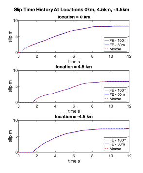

*Figure 26 Time History of Slip (FE - 50m, FE - 100m, Moose) at locations 0 km, 4.5 km, -4.5 km*

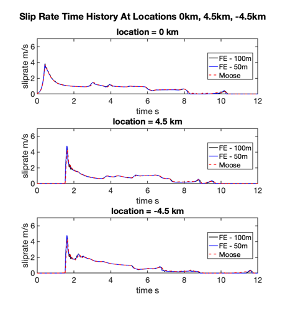

*Figure 27 Time History of Slip rate (FE - 50m, FE - 100m, Moose) at locations 0 km, 4.5 km, -4.5 km*

The L2 error norm is measured with FE – 100m for full time history of
slip, which gives error within 5%:

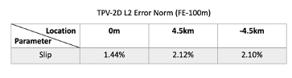

*Figure 28 TPV205-2D L2 Error Norm of Slip (FE-100m, MOOSE) at locations (0m, 4.5km, -4.5km)*

### Verification Case: TPV205-3D

#### Mesh

A cubic mesh (30km $\times$ 30km $\times$ 30km) with uniform **QUAD4**
element and mesh size 200m is created using MOOSE built-in mesh
generator, following the descriptions in the previous section, the fault
is represented as an x-z plane surface using **Cohesive Zone Model**.

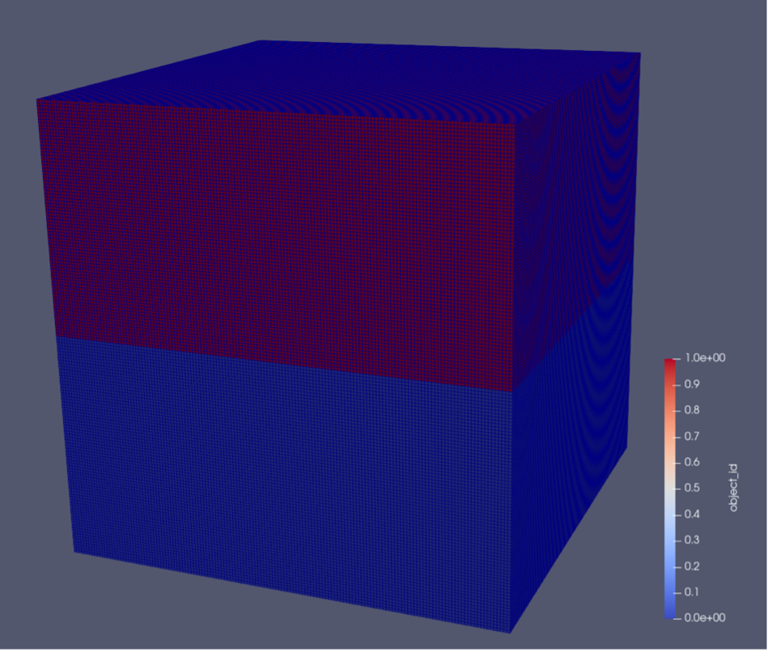

*Figure 29 Example 3D Mesh Configuration with QUAD4 Element (0 - lower block, 1 - upper block)*

**Problem Description**

We use the benchmark problem TPV205-3D from the SCEC Dynamic Rupture Validation exercises. Figure 24 shows the setup of the problem at x-z fault surface plane. The following assumptions are made:

1.  Fault is governed by linear slip-weakening friction law,

2.  Linear elastic homogeneous bulk material.

The rupture is nucleated within a (3km $\times$ 3km) overstressed region which the nucleation center is located at strike(x) 0m, dip(z) 7.5km. The normal stress is uniform along the entire fault length while initial shear stress $\tau_{xy}$ (along strike direction) is nonuniform, while initial shear stress $\tau_{zy}$ (along dip direction) is kept zero. Two strength barriers (3km $\times$ 3km) with the centers located at the strike -7.5km, dip 7.5km on the left and the strike 7.5km, dip 7.5km on the right of the overstressed region on the fault. The barriers (dip \> 15km) provide enough static frictional strength to stop the rupture propagation along dip direction.

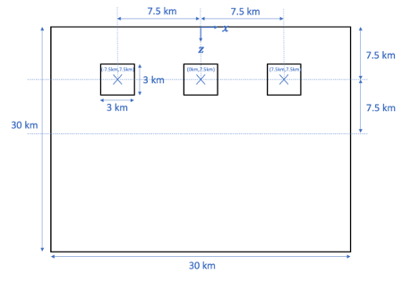

*Figure 30 Fault Surface Background Shear Stress Distribution*

The parameter table used for this validation is summarized in Table 2.

<table>
<colgroup>
<col style="width: 30%" />
<col style="width: 44%" />
<col style="width: 25%" />
</colgroup>
<thead>
<tr class="header">
<th>Variable</th>
<th>Value</th>
<th>Description</th>
</tr>
</thead>
<tbody>
<tr class="odd">
<td><span class="math display"><strong>ρ</strong></span></td>
<td>2670 <span
class="math inline"><em>k</em><em>g</em>/<em>m</em><sup>3</sup></span></td>
<td>Density</td>
</tr>
<tr class="even">
<td><span
class="math display"><strong>λ</strong> <strong>=</strong> <strong>μ</strong></span></td>
<td>32.04 <span
class="math inline"><em>G</em><em>P</em><em>a</em></span></td>
<td>Lame Parameters</td>
</tr>
<tr class="odd">
<td><span
class="math display"><strong>T</strong><sub><strong>2</strong></sub><sup><strong>O</strong></sup></span></td>
<td>120 <span
class="math inline"><em>M</em><em>P</em><em>a</em></span></td>
<td>Background Normal Stress</td>
</tr>
<tr class="even">
<td><p><span
class="math display"><strong>T</strong><sub><strong>1</strong></sub><sup><strong>O</strong></sup></span></p>
<p>(<span
class="math inline"><strong>6</strong><strong>k</strong><strong>m</strong> <strong>≤</strong> <strong>z</strong> <strong>≤</strong> <strong>9</strong><strong>k</strong><strong>m</strong><strong>)</strong></span></p></td>
<td><span class="math display">

81.6 $MPa$, $|x|$ &lt; 1.5$km$;
78.0 $MPa$,  - 9$km$ < $x$ < - 6$km$;
62.0 $MPa$,  6$km$ < $x$ < 9$km$;
70   $MPa$,  elsewise 
</span></td>
<td>Background Shear Stress</td>
</tr>
<tr class="odd">
<td><span
class="math display"><strong>D</strong><sub><strong>c</strong></sub></span></td>
<td>0.4 <span class="math inline"><em>m</em></span></td>
<td>Characteristic Length</td>
</tr>
<tr class="even">
<td><span
class="math display"><strong>μ</strong><sub><strong>s</strong></sub></span></td>
<td><span class="math display">
0.677, |x| &lt; 15km 
10000, |x| &gt; 15km </span></td>
<td>Static Friction Parameter</td>
</tr>
<tr class="odd">
<td><span
class="math display"><strong>μ</strong><sub><strong>d</strong></sub></span></td>
<td>0.525</td>
<td>Dynamic Friction Parameter</td>
</tr>
<tr class="even">
<td><span
class="math display"><strong>Δ</strong><strong>x</strong></span></td>
<td>200 m</td>
<td>Mesh Size</td>
</tr>
</tbody>
</table>

*Table 2 Simulation Parameter Table*

#### Results

The simulation runs up to *3s*. The results here compare the current implementation (Moose) and reported benchmark data with mesh size 100m, 200m (FEM 100m, FEM 200m) for the time history of slip and slip rate observed in several site locations
$x = - 4.5km,\ \ x = 0km,\ \ x = 4.5m.$ with same dip distance 7.5km.

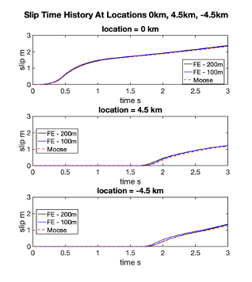

*Figure 31 Time History of Slip (Reference FE - 200m, FE – 100m, Moose) at locations 0 km, 4.5 km, -4.5 km*

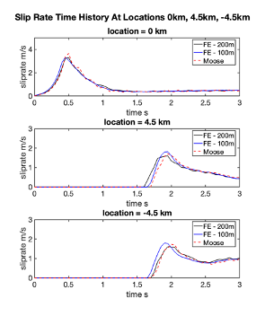

*Figure 32 Time History of Slip Rate (Reference FE - 200m, FE – 100m, Moose) at locations 0 km, 4.5 km, -4.5 km*

Good agreements can be observed especially compared with FE-100m results. With the help of mesh refinement and lager domain size, the results are promised to match for the full-time history (up to 12s).

The L2 error norm between (FE-100m and MOOSE-200m) is documented in the following chart with the error within 5%:

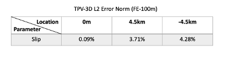

*Figure 33 TPV-3D L2 Error Norm of Slip (FE-100m, MOOSE-200m) at locations (0m, 4.5km, -4.5km)*

#### Code Availability

All code is in GitHub repository <https://github.com/chunhuizhao478/farms.git>. The code will be shared upon request.

2D verification case is under the folder “[farms](https://github.com/chunhuizhao478/farms)/[examples](https://github.com/chunhuizhao478/farms/tree/main/examples)/[benchmark_tpv2052D](https://github.com/chunhuizhao478/farms/tree/main/examples/benchmark_tpv2052D)/version3/”.

3D verification case is under the folder “[farms](https://github.com/chunhuizhao478/farms)/[examples](https://github.com/chunhuizhao478/farms/tree/main/examples)/[benchmark_tpv2053D](https://github.com/chunhuizhao478/farms/tree/main/examples/benchmark_tpv2053D)/version3/”.

#### Bibliography

Day, S. M. (2005). *Comparison of finite difference and boundary integral solutions to three‐dimensional spontaneous rupture.* Journal of Geophysical Research: Solid Earth, 110(B12).

Harris, R. M.-P.-A. (2009). The SCEC/USGS Dynamic Earthquake Rupture Code Verification Exercise. *Seismological Research Letters*, vol. 80, no. 1, pages 119-126.

Ma, X. H. (2019). *A hybrid finite element‐spectral boundary integral approach: Applications to dynamic rupture modeling in unbounded domains.* International Journal for Numerical and Analytica.
