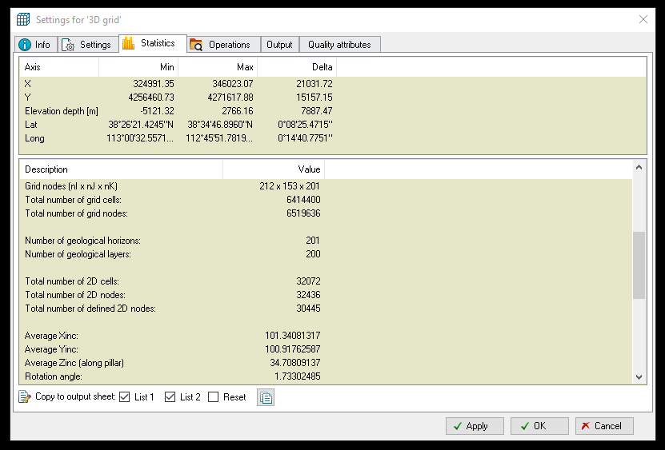
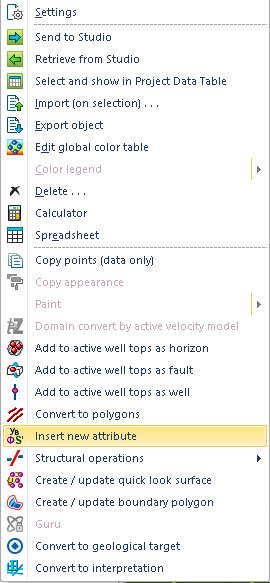
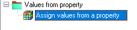
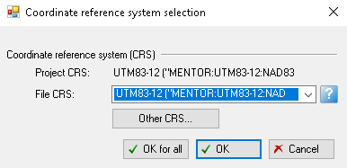

# A Workflow of Nodal Attributes Generation from Petrel

## Developers

* Miu-Lun (Andy) Lau
* Yidong Xia

## Introduction
This workflow describes the workout to generate a textfile containing nodal coordinates with attributes from [Petrel](https://www.software.slb.com/products/petrel). In reservoir engineering, Petrel is often used to create structural models of faults and other geological features. The structure models are gridded using pillar grid geometry, and well data is interpeted into 3D propertie volumes using stochastic algorithms. The following workflow outlines the procedure to extract the attributes' data from Petrel.  

__The workflow consists of three sections:__

* **Section 1.** Record nodal boundaries from **Petrel**.
* **Section 2.** Use __SplitSquareGrid script__ to generate a point file.
* **Section 3.** Extract attributes data from **Petrel** into nodal file.

Currently __Section 2__ is accomplished though Python script, where __Section 1__ and __Section 3__ involve manual operation. 
## Prerequisites
A list of software packages required for this workflow is as below:

* Python (Version 2.7.13)
* [Petrel](https://www.software.slb.com/products/petrel)

## WorkFlow
### Section 1. Identify Nodal Boundaries from Petrel

* Start **PETREL**.
* Open Petrel project file **"example.ptd"**.
* In Models Pane, expand your petrel model.
* Scroll down to **3D grid**, rightclick and select **Settings**.

	
	
* Navigate to **Statistics** tab and record the XYZ boundaries in **Axis** window and the average Xinc, Yinc, and Zinc in **Description** window. 
	

### Section 2. Use SplitSqaureGrid Python Script to Generate Points File

* With nodal boundaries known, navigate to **../falcon/utilities/splitsquaregrid** and enter the command:

```
./run_test
```

* Enter the limits of each axis, and the number of cells in each direction.

	
	
* A points file named **example.txt** that contains all nodes is generated in the same directory. 


### Section 3. Extract Attibutes Data from PETREL into Nodal File

* Start **PETREL**.
* Open Petrel Project **"example.ptd"**.
* Right click on empty space inside **Input Toolbar** and select **Import File**.
	
	

* Navigate to the Nodal file(**"example.txt"**) and select **Open**, ensure the format is **Irap Classic Points(ASCII)**.

	

* A window call **Input Data** will show up, verify the project(**"example.ptd"**) coordinate reference system(CRS) and file(**"example.txt"**) CRS is identical.
* Uncheck **[Neglect Z value when mostly positive]** and select **OK**.

	

* In Input Pane,
	* Right click on **example.txt**.
	* Select **Insert new attributes** and choose **Continous**.
	
		
	
* In the __Operations Tabs__,
	* Expand **"expand values from property"** and select **"Assign values from properties"**.

		
	* In the model pane, expand the Models then expand __Properties__.
	* Select one attribute.
	* Click on __Blue Arrow__ to import attribute and choose **Run** to apply.

		
		
	* Repeat for additional properties.
* To output final data file, right click on the grid file (**example.txt**),
	* Select **Export Object**
	
		
	* Enter filename and change the format to **Petrel Points with Attributes** 

		
	
	* Again, check to ensure both files have identical CRS, and click __OK__ to export 

		

## Side Note

* Verify the units from Petrel is proper unit. In geophysics, density is often expressed in **g/cm^3** and porosity as __parts of 100__. 
	* __TetgenMESH__ has included options to convert unit into standard unit(SI)
 
* In Petrel, __null__ values will automatically change to __-999__. 